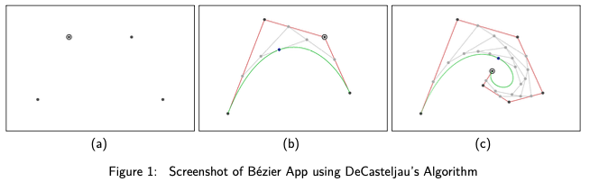
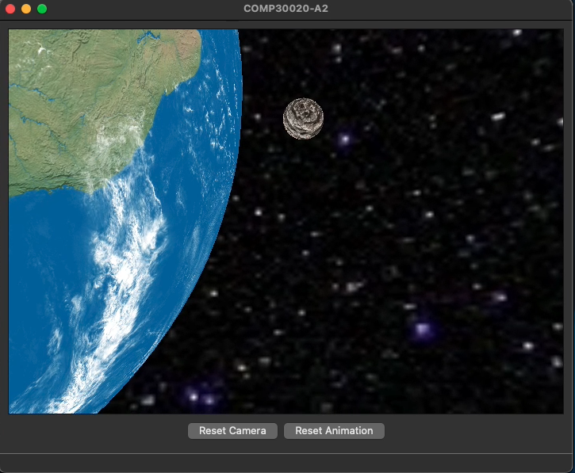

# ComputerGraphics_OpenGL_QT
 
The assignment 1 detailed in "InstructionsA1.pdf" focuses on the implementation and visualization of `Bézier curves`, a fundamental concept in computer graphics. Key tasks include:

- Drawing a Control Polygon: 
    -   Implementing a function to render the control polygon of a Bézier curve.
- `DeCasteljau's Algorithm`:  
    - Implementing DeCasteljau's algorithm for interactive visualization of the curve construction process.
- Bézier Curve Rendering: 
    - Developing a function to draw the actual Bézier curve using the implemented DeCasteljau's algorithm.



Example Code:
```c++
// draw a disc at vertex location
void GLWidget::drawVertex(Point p, int brushSize, RGBValue color) {
    int size = brushSize / 2;
    Point vertex = p;
    vertex.y = height - 1 - vertex.y; // Flip y vertex

    for (int i = -size; i < size; i++) {
        for (int j = -size; j < size; j++) {
            // draw disc with radius size
            if (i * i + j * j <= size * size) {
                image.setPixel(static_cast<Index>(vertex.y + i), static_cast<Index>(vertex.x + j), color);
            }
        }
    }
}
```

Assignment 2 emphasizes the use of OpenGL for 3D modeling and animation, allowing students to apply animation hierarchies and techniques discussed in lectures.
- Modeling a character with basic body parts: a head, body, two arms with elbow joints, and two legs with knee joints, using simple geometric primitives in OpenGL.
- Implementing an animation for the character. The animation can start simple, like moving the character in a circle, and then progress to more complex movements. The character must move along a predefined path.
### User Interface
```xml
<ui version="4.0">
 <class>MainWindow</class>
 <widget class="QMainWindow" name="MainWindow">
  <property name="geometry">
   <rect>
    <x>0</x>
    <y>0</y>
    <width>723</width>
    <height>574</height>
   </rect>
  </property>
  <property name="windowTitle">
   <string>MainWindow</string>
  </property>
  <widget class="QWidget" name="centralWidget">
   <layout class="QVBoxLayout" name="verticalLayout">
```

